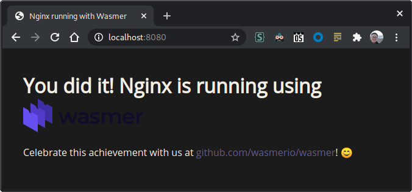

# Introduction

This project is for understanding how to use WASM in different scenarios.

- Walk through different WASM compiler cases via a self-explanatory Makefile to know what WASM or WASI is
- Run nginx.wasm on wasmer using `cranelift` to make necessary system calls supported in the final machine code, instead of using insufficient WASI API implementation
- Have a demo flow to introduce how to use K8s and Krustlet (experimental) to manage WASI complaint WASM workload

## What's WASM, WASI, in/outside browser, WASM runtime?

### WASM in browsers

- The API between WASM and browsers is Web APIs, but each browser can still have its specific APIs used by the vendor-locking wasm.

### WASM outside browsers

- The API between WASM and runtime is WASI API which is implemented in different runtime but wasi-libc and wasi-sdk provided by WebAssembly org.

### WASI-WASM in browsers

- The API between WASM and browser is WASI API, but the middle adapter (WASM polyfill JS library) is required to transfer the WASI API to Web APIs.   

### WASM runtimes

- Runtime providers try to support WASI compliant + extra features for each specific needs.

# Prerequisites

## Common

- Rust toolchains

```console
curl https://sh.rustup.rs -sSf | sh
```

## Demo 1

- Emscripten SDK 

```console
make install-emsdk
```
  
- Rust wasm32 compile toolchain targets

```console
rustup target install wasm32-wasi
rustup target install wasm32-unknown-unknown
rustup target install wasm32-unknown-emscripten
```

## Demo 2
- wasmtime
- wasm-to-oci
- krustlet
- kind
- kubectl
- kustomize
- AZ CLI

```console
curl -L https://aka.ms/InstallAzureCli | bash
```

You can use [huber](https://github.com/innobead/huber) to install most dependencies except rust, azcli, and emsdk.

```console
huber install wasmtime wasm-to-oci krustlet kind kubectl kustomize
```

# Demo 1 - WASM, WASI

## Compilation Scenarios
```console
❯ make
build-cpp-emscripten-js             Build wasm32-unknown-emscripten hello world 'non-standalone' application vis emcc.
build-cpp-emscripten-wasm           Build wasm32-unknown-emscripten hello world 'standalone' application vis emcc.
build-dev-container                 Build dev container image
build-rust-emscripten-helloworld    Build wasm32-unknown-emscripten hello world application. Only wasm + JS output supported in Rust
build-rust-wasi-helloworld          Build wasm32-wasi hello world application
build-rust-wasi-httpserver          Build wasm32-wasi http server application. This will be failed because system call not supported
clean                               Clean
install-emsdk                       Install Emscripten SDK
run-nginx-emscripten                Run nginx.wasm built by emscripten on wasmer runtime
```

## Run nginx.wasm on wasmer

By running the below command, you should be able to access http://localhost:8080

```console
❯ make run-nginx-emscripten
# https://syrusakbary.medium.com/running-nginx-with-webassembly-6353c02c08ac
docker run -p 8080:8080 -w /workspace/wasmer-nginx-example wasi-demo-dev:latest /root/.wasmer/bin/wasmer run nginx.wasm -- -p . -c nginx.conf
2021/02/03 15:39:36 [notice] 1#0: using the "select" event method
2021/02/03 15:39:36 [notice] 1#0: nginx/1.15.3
2021/02/03 15:39:36 [notice] 1#0: built by clang 6.0.1  (emscripten 1.38.11 : 1.38.11)
2021/02/03 15:39:36 [notice] 1#0: OS: Linux 5.3.18-lp152.60-default

```



# Demo 2 - Krustlet

## Create a WASI application

```console
rustup target install wasm32-wasi
cargo init <app>
```

```console
cd <app>
cargo build --target wasm32-wasi
ls -al target/wasm32-wasi
```


## Run the WASI application on host

```console
wasetime target/wasm32-wasi/debug/<app>.wasm
```

## Package and Publish the WASI application to the OCI compatible registry

```console
az acr login --name dkoacr
linuxwasm-to-oci push target/wasm32-wasi/debug/<app>.wasm <acr-name>.azurecr.io/<app>:<version>
```

## Pull the WASI application from the OCI compatible registry

```console
linuxwasm-to-oci pull <acr-name>.azurecr.io/<app>:<version> -o <app>.wasm
wasmtime <app>.wasm
```

## Run the WASI application on the K8s cluster (Krustlet)

### 1. Set up a K8s cluster

```console
kind create cluster
```

### 2. Setup and Join a krustlet node

```console
# Prepare bootstrap token
bash <(curl https://raw.githubusercontent.com/deislabs/krustlet/master/docs/howto/assets/bootstrap.sh)
ls ~/.krustlet/config/bootstrap.conf

# Run krustlet, create the CSR (<hostname>-tls)
NODE_IP=$(ip -o -4 addr show docker0 | awk '{print $4}' | cut -d/ -f1)
KUBECONFIG=~/.krustlet/config/kubeconfig krustlet-wasi \
  --node-ip=$NODE_IP \
  --hostname=demo \
  --node-name=demo \
  --bootstrap-file ~/.krustlet/config/bootstrap.conf

# Approve signing the serving certification
kubectl certificate approve demo-tls

# Show registered nodes including krustlet node
kubectl get nodes
```

### 3. Set up a container registry

```console
./scripts/manage-acr.sh create_acr
```

### 4. Create a WASI application

[Ref](#create-a-wasi-application)

### 5. Package and Publish the WASI application to the OCI compatible registry

[Ref](#package-and-publish-the-wasi-application-to-the-oci-compatible-registry)

### 6. Create the secret for pulling images from the container

```console
./scripts/manage-acr.sh create_acr_access_secret
```

```console
kustomize edit set image dkoacr.azurecr.io/wasi-demo:v0.0.0 <acr-name>.azurecr.io/<app>:<version>
```

### 7. Create the WASI application deployment

```console
kustomize build ./examples/krustlet | kubectl apply -f -
kubectl logs -f wasi-demo
```
### 8. Clean up

```console
kustomize build ./examples/krustlet | kubectl delete -f -
./scripts/manage-acr.sh delete_acr_access_secret delete_acr
kind delete cluster

# stop kurstlet process
```

# Notes

## Emscripten SDK compatible issues with Rust

Don't install the latest emsdk, because there is a [LLVM compatible issue](https://github.com/emscripten-core/emscripten/issues/12551#issuecomment-732648120) happening 
in between the recent versions of emscripten and Rust.

# References

- https://webassembly.org/
- https://wasi.dev/
- https://wasmtime.dev/
- https://bytecodealliance.org/
- https://github.com/deislabs/krustlet/tree/master/docs
- https://emscripten.org/index.html
- https://github.com/bytecodealliance/wasmtime/blob/main/docs/WASI-overview.md
- https://github.com/WebAssembly/wasi-libc
- https://github.com/WebAssembly/wasi-sdk
- https://github.com/bytecodealliance/wasmtime
- https://github.com/bytecodealliance/lucet
- https://github.com/bytecodealliance/wasmtime/tree/main/cranelift (wasm bytecode -> machine code)
- https://github.com/WebAssembly/binaryen (-> wasm bytecode)
- https://v8.dev/blog/emscripten-standalone-wasm
- https://wasmbyexample.dev/
- https://surma.dev/things/c-to-webassembly/
- https://github.com/denverdino/containerd-wasm
- https://wascc.dev/
- https://radu-matei.com/blog/towards-sockets-networking-wasi/
- https://hacks.mozilla.org/2019/03/standardizing-wasi-a-webassembly-system-interface/
